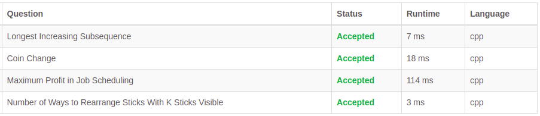

# Exercícios LeetCode

**Conteúdo da Disciplina**: Programação Dinâmica 

## Alunos
|Matrícula | Aluno |
| -- | -- |
| 18/0062760  |  [Bruno Bernardes Duarte](https://github.com/brunobd) |

## Sobre 
Este repositório contem a solução de alguns exercícios do site [LeetCode](www.leetcode.com):

- [300. Longest Increasing Subsequence](https://leetcode.com/problems/longest-increasing-subsequence/)
- [322. Coin Change](https://leetcode.com/problems/coin-change/)
- [1235. Maximum Profit in Job Scheduling](https://leetcode.com/problems/maximum-profit-in-job-scheduling/)
- [1866. Numbe of Ways to Rearrange Sticks With K Sticks Visible](https://leetcode.com/problems/number-of-ways-to-rearrange-sticks-with-k-sticks-visible/)

## Screenshots

## Utilização
Basta acessar o link de cada problema e submeter o código, é necessário criar uma conta no LeetCode para rodar o código.

## Explicação
### [300. Longest Increasing Subsequence](https://leetcode.com/problems/longest-increasing-subsequence/)

### [322. Coin Change](https://leetcode.com/problems/coin-change/)

### [1235. Maximum Profit in Job Scheduling](https://leetcode.com/problems/maximum-profit-in-job-scheduling/)

### [1866. Numbe of Ways to Rearrange Sticks With K Sticks Visible](https://leetcode.com/problems/number-of-ways-to-rearrange-sticks-with-k-sticks-visible/)

